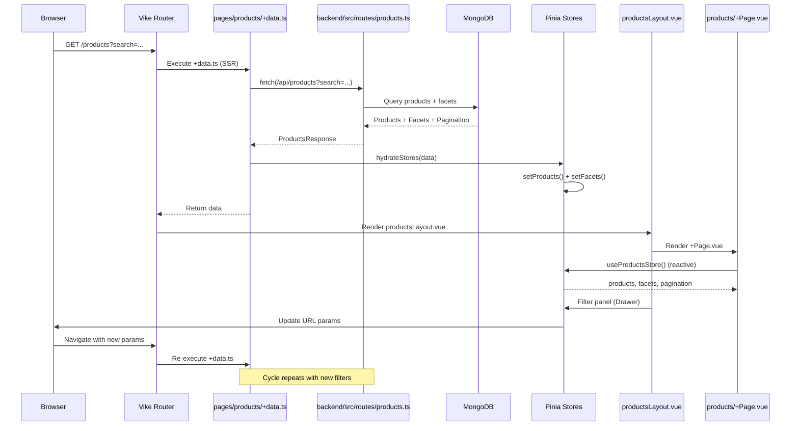

# Test Technique

## Objectif

Afficher une liste de produits avec filtres par facettes (faceted search).

## Stack

- **Frontend** : [Vike](https://vike.dev) + Vue 3 + TypeScript
- **UI** : [PrimeVue](https://primevue.org) + [Tailwind CSS](https://tailwindcss.com)
- **State Management** : Pinia
- **Backend** : Fastify + TypeScript
- **Base de données** : MongoDB 8
- **Infrastructure Locale** : Docker Compose

## Prérequis

- Docker & Docker Compose
- Node.js 22

## Organisation du projet

### Backend

**Endpoint principal à développer** : `backend/src/routes/products.ts`

L'organisation du code est libre. Vous devez mettre à jour l'endpoint `GET /api/products` pour retourner des données conformes à `frontend/src/types/ProductsResponse` :

```typescript
export interface ProductsResponse {
  products: Product[];
  pagination: Pagination;
  facets: Facets;
}
```

**Modèle Product** :
```javascript
{
  _id: ObjectId,
  name: String,
  description: String,
  category: String,
  brand: String,
  price: Number,
  inStock: Boolean,
  tags: [String],
  createdAt: Date,
  updatedAt: Date
}
```

### Frontend

**Page principale** : `frontend/pages/products/+Page.vue`
- Les données sont hydratées via `+data.ts` mais **vous devez retravailler les types** pour correspondre à `ProductsResponse`
- Les stores Pinia sont dans `frontend/datastore/` :
  - `products.store.ts` : gestion des produits, filtres, facettes, pagination
  - `productIndexes.store.ts` : gestion des index de recherche
  - `product.store.ts` : gestion d'un produit individuel

**Layouts** : `frontend/Layout/productsLayout.vue`
- Vous trouverez un **panel filter** dans les layouts (Drawer PrimeVue)
- À compléter avec l'affichage des facettes et l'application des filtres

**Organisation** :
- L'organisation du projet (composants, méthodes, etc.) est **libre**
- Respectez les web standards pour les filtres (URL params, navigation, etc.)
- Interface minimaliste et élégante

## Démarrage

```bash
docker-compose build
docker-compose up -d
```

- Backend : `http://localhost:3000`
- Frontend : `http://localhost:5173`
- MongoDB : `mongodb://localhost:27018`
- Livesync frontend : `npm run dev` (dans `frontend/`)

### Génération et chargement des données

Les produits sont générés automatiquement lors du `docker-compose build` (10000 produits par défaut).

Le seed s'exécute **automatiquement** au démarrage via `docker-compose up` :
- Vérifie si la base contient moins de 1000 produits
- Si oui, charge les 10000 produits depuis `products.json`
- Si non, skip le seed (pour éviter de réinsérer à chaque démarrage)

Les indexes MongoDB sont créés automatiquement au démarrage du conteneur.

**Note** : Pour forcer un re-seed, supprimez les données MongoDB ou exécutez manuellement :
```bash
docker-compose run --rm seed npm run seed
```

## Critères d'évaluation

- Architecture et organisation du code
- Qualité du code
- Performance (pagination, indexation MongoDB)
- Système de facettes (compteurs, mise à jour réactive)
- UX/UI

## Livrable

Le projet sera testé uniquement via `docker compose`. Veillez aux indexes MongoDB.

## Architecture SSR

Le processus de rendu côté serveur (SSR) suit ce flux :



**Points clés** :
1. **SSR** : `+data.ts` s'exécute côté serveur et récupère les données
2. **Hydration** : Les données sont injectées dans les stores Pinia via `hydrateStores()`
3. **Réactivité** : Les composants Vue utilisent les stores pour un rendu réactif
4. **Navigation** : Les filtres mettent à jour l'URL, déclenchant un nouveau cycle SSR
5. **Layout** : Le panel de filtres dans `productsLayout.vue` interagit avec le store
